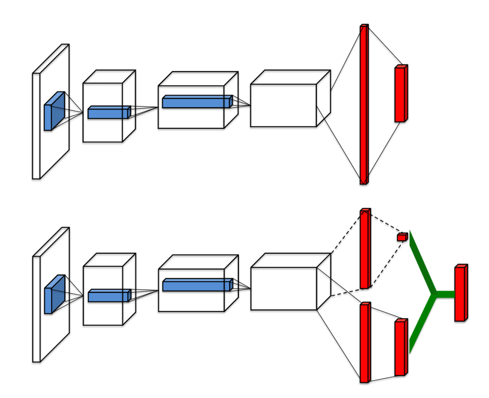

# Middle-Term Report Break-out with DQN

## Exprimental Environment

- Provided by the course

## Theory

### Q-Learning

Q-Learning is a model-free reinforcement learning algorithm. It is a model-free, off-policy TD control algorithm. It can be used to find the optimal action-selection policy for any given Markov decision process (MDP). It learns a policy, which tells an agent what action to take under what circumstances. It does not require a model (hence the connotation "model-free") of the environment, and it can handle problems with stochastic transitions and rewards, without requiring adaptations.

Q-Learning represents the action-value function as a table, with one row for each state and one column for each action. The value of each entry is the expected return starting from that state and taking that action, then following the policy thereafter. The policy is derived from the action-value function, by selecting the action with the highest expected return for each state.

| State | Action | Value |
| :---: | :----: | :---: |
| s1    | a1     |  v1  |
| s2    | a2     |  v2  |
| ...    |  ...    |  ...  |

**Howerver**, the breakout game is a continuous state space, it's hard and inefficient to store the Q-table. So we use a neural network to approximate the Q-table. That is what we will introduce later.

### Deep Q-Learning Network (DQN)

DQN use neural network to approximate the Q-table. Neural network can be regarded as a function approximator. It can approximate the Q-table. The input of the neural network is the state of the game, and the output is the Q-value of each action.


1. Bellman Equation, which is the core of Q-Learning, is used to update the Q-value of each action.
$$
Q(s_t, a_t) = r_t + \gamma \max_{a} Q(s_{t+1}, a)
$$
2. The neural network is trained by minimizing the loss function, which is the mean square error between the target Q-value and the predicted Q-value.
$$
L = \frac{1}{2} \sum_{t=1}^T (r_t + \gamma \max_{a} Q(s_{t+1}, a) - Q(s_t, a_t))^2
$$
3. $\epsilon$-greedy policy is used to balance exploration and exploitation. The agent will choose the action with the highest Q-value with probability $1-\epsilon$, and choose a random action with probability $\epsilon$.
$$
p = random(0, 1)
$$
$$
action = \begin{cases}
argmax(Q(s_t, a)) & p > \epsilon \\
random(a) & p \leq \epsilon
\end{cases}
$$

### Experience replay

Since the game is a continuous state space, the agent will experience a lot of transitions. If we train the neural network with the transitions in order, the neural network will be biased. So we use experience replay to store the transitions and sample them randomly to train the neural network.

The agent will store the experience $(s_t, a_t, r_t, s_{t+1})$ in a replay buffer, and `randomly sample` a batch of experience to train the neural network. The replay buffer is a queue, and the size of the queue is `MEM_SIZE`. The agent will sample a batch of experience with size `batch_size` from the replay buffer to train the neural network.

By using experience replay, the agent can learn from the experience in a random order, which can break the correlation between the samples. It can improve the stability of the training process.


### Double DQN

People finds that DQN tends to overestimate the Q-value. This is because Q-value is estimated by the maximum value of next state. And the value of the next state is also overestimated. Step by step, the Q-value graually devate from the actual value.

Double DQN uses two neural networks to estimate the Q-value. One is used to select the action(`target network`), and the other(`policy network`) is used to estimate the Q-value. In this way, devation can be avoided.

$$
y_t = r_t + \gamma Q(s_{t+1}, argmax_{a} Q(s_{t+1}, a; \theta_{policy}); \theta_{target})
$$

### Dueling DQN

> In many states, it is unnecessary to estimate the value of all actions. 

In our `atari breakout game`, knowing whether to move left, right or do nothing only matters when the ball is close to the bottom line. In most other states, the agent can just keep still and do nothing. So there is some states important and necessary to know what to do. DUELING_DQN can discriminate whether the state is important or not.

Dueling DQN divides the Q-value into two parts: state value and action advantage. The state value is the value of the state $V(s, \theta, \beta)$, and the action advantage is the advantage of each action $A(s, a; \theta, \alpha)$. And the final Q value is combined with state value and action advante value.
$$
Q(s, a; \theta, \alpha, \beta) = V(S;w,a)+(A(S,A;w,\beta)-\frac{1}{\mathcal{A}}\sum_{a'\in |\mathcal{A}|}A(a,a';w,\beta)) 
$$



We can find that DUELING_DQN can be implemented as a part of the network. Training of the DUELING_DQN is almost the same as DQN. They share the same input nad output that we only need to change the network part.

## Implementation

### main.py

`main.py` is the entry of the program. It will create the environment, the agent, and the replay buffer. Then it will start the training process.

First we define some hyperparameters.
1. `GAMMA` is is the discount factor.
2. `MEM_SIZE` is the size of the replay buffer.
3. `STACK_SIZE` is the number of frames stacked together to form a state.
4. `EPS_START` is the initial value of $\epsilon$.
5. `EPS_END` is the final value of $\epsilon$.
6. `EPS_DECAY` is the decay rate of $\epsilon$.
7. `BATCH_SIZE` is the size of the batch sampled from the replay buffer.
8. `POLICY_UPDATE` is the number of steps to update the policy network.
9. `TARGET_UPDATE` is the number of steps to update the target network.
10. `WARM_STEPS` is the number of steps to fill the replay buffer.`

```python
GAMMA = 0.99
GLOBAL_SEED = 0
MEM_SIZE = 100_000
RENDER = False
SAVE_PREFIX = "./models"
STACK_SIZE = 4

EPS_START = 1.
EPS_END = 0.1
EPS_DECAY = 1000000

BATCH_SIZE = 32
POLICY_UPDATE = 4
TARGET_UPDATE = 2000
WARM_STEPS = 1000
MAX_STEPS = 5000000
EVALUATE_FREQ = 10000
```

Then we initialize the random seed, computing devices, environment `env`, Agent `agent` and ReplayMemory `memory`

```python
rand = random.Random()
rand.seed(GLOBAL_SEED)
new_seed = lambda: rand.randint(0, 1000_000)

torch.set_num_threads(32)

last = []

for dirpath, dirnames, filenames in os.walk(SAVE_PREFIX):
    last = [i for i in filenames if not i.endswith("mem")]
    break

if len(last) == 0:
    print("No model found, creating new one.")
    os.makedirs(SAVE_PREFIX, exist_ok=True)
    torch.manual_seed(new_seed())
    device = torch.device("cuda")
    env = MyEnv(device)
    agent = Agent(
        env.get_action_dim(),
        device,
        GAMMA,
        new_seed(),
        EPS_START,
        EPS_END,
        EPS_DECAY,
        BASIC_MODEL
    )
    memory = ReplayMemory(STACK_SIZE + 1, MEM_SIZE, device)
else:
    last = sorted(last)[-1]
    print(f"Loading model from {last}")
    BASE_COUNT = int(last.split("_")[1])
    torch.manual_seed(new_seed())
    device = torch.device("cuda")
    env = MyEnv(device)
    agent = Agent(
        env.get_action_dim(),
        device,
        GAMMA,
        new_seed(),
        EPS_START,
        EPS_END,
        EPS_DECAY,
        os.path.join(SAVE_PREFIX, last),
    )
    memory = ReplayMemory(STACK_SIZE + 1, MEM_SIZE, device)
    memory.load(os.path.join(SAVE_PREFIX, last + ".mem"))
```

After that, we can start to train the agent.

The agent play games step by step. And when game finishes, the env will be reset and a new game starts.

```python
for step in progressive:
    if done:
        observations, _, _ = env.reset()
        for obs in observations:
            obs_queue.append(obs)
```

training = true if running for WARM_STEPS, which means the network can start to train

```python
training = len(memory) > WARM_STEPS
```

observe the current state, and get an action according to the state. Then make action to get new observation.

```python
state = env.make_state(obs_queue).to(device).float()
action = agent.run(state, training)
obs, reward, done = env.step(action)
```

Then put the observation into the queue and memory buffer.

```python
obs_queue.append(obs)
memory.push(env.make_folded_state(obs_queue), action, reward, done)
```

The agent learn every POLICY_UPDATE steps.

```python
if step % POLICY_UPDATE == 0 and training:
    agent.learn(memory, BATCH_SIZE)
```

The agent update the target network every TARGET_UPDATE steps.

```python
if step % TARGET_UPDATE == 0:
    agent.sync()
```

The agent save the model every EVALUATE_FREQ steps.

```python
if step % EVALUATE_FREQ == 0:
    avg_reward, frames = env.evaluate(obs_queue, agent, render=RENDER)
    with open("rewards.txt", "a") as fp:
        fp.write(f"Cur: {BASE_COUNT + step//EVALUATE_FREQ:03d} Reward: {avg_reward:.4f}\n")

    progressive.set_description(f"reward: {avg_reward:.4f}")

    if avg_reward < BEST_AWARD:
        continue

    BEST_AWARD = avg_reward
    progressive.write(f"\rSaving model with reward {avg_reward:.4f}")

    agent.save(os.path.join(
        SAVE_PREFIX, f"model_{BASE_COUNT + step//EVALUATE_FREQ:03d}"))
    memory.save(os.path.join(
        SAVE_PREFIX, f"model_{BASE_COUNT + step//EVALUATE_FREQ:03d}.mem"))

    if last_saved_mem != '':
        os.remove(os.path.join(SAVE_PREFIX, last_saved_mem))
```

### utils_drl.py

`Agent` class is implemented in `utils_drl.py`. It contains the policy network, target network, optimizer, loss function, and other functions.

`__init__()` initializes the model parameters.

```python
def __init__(
        self,
        action_dim: int,
        device: TorchDevice,
        gamma: float,
        seed: int,

        eps_start: float,
        eps_final: float,
        eps_decay: float,

        restore: Optional[str] = None,
) -> None:
    self.__action_dim = action_dim
    self.__device = device
    self.__gamma = gamma

    self.__eps_start = eps_start
    self.__eps_final = eps_final
    self.__eps_decay = eps_decay

    self.__eps = eps_start
    self.__r = random.Random()
    self.__r.seed(seed)

    self.__policy = DQN(action_dim, device).to(device)
    self.__target = DQN(action_dim, device).to(device)
    if restore is None:
        print("Initialized weights.")
        self.__policy.apply(DQN.init_weights)
    else:
        print("Restored weights from", restore)
        self.__policy.load_state_dict(torch.load(restore, map_location=device))
    self.__target.load_state_dict(self.__policy.state_dict())
    self.__optimizer = optim.AdamW(
        self.__policy.parameters(),
        lr=0.0002,
        eps=1.5e-4,
    )
    self.__target.eval()

    self.eval_mode = False
```

`run()` returns an action according to the current state. It uses `epsilon-greedy` policy to select the returned action.

```python 
def run(self, state: TensorStack4, training: bool = False) -> int:
    """run suggests an action for the given state."""
    if training:
        self.__eps -= \
            (self.__eps_start - self.__eps_final) / self.__eps_decay
        self.__eps = max(self.__eps, self.__eps_final)

    if self.eval_mode or (training and self.__r.random() > self.__eps):
        with torch.no_grad():
            return self.__policy(state).max(1).indices.item()
            
    return self.__r.randint(0, self.__action_dim - 1)
```

`learn()` trains the policy network and update it by `Back propagation`

```python
def learn(self, memory: ReplayMemory, batch_size: int) -> float:
    """learn trains the value network via TD-learning."""
    state_batch, action_batch, reward_batch, next_batch, done_batch = \
        memory.sample(batch_size)

    # evaluate the policy value
    values = self.__policy(state_batch.float()).gather(1, action_batch)
    # evaluate the target value

    if DQN_MODE == DQNMode.DOUBLE_DQN:
        # DOUBLE_DQN
        next_actions = self.__policy(next_batch.float()).max(1).indices
        values_next = self.__target(next_batch.float()).gather(1, next_actions.unsqueeze(1))
    # elif DQN_MODE == DQNMode.DUELING_DQN: 
    else:
        # NORMAL_DQN
        values_next = self.__target(next_batch.float()).max(1).values.detach()
    # compute the expected value
    expected = (self.__gamma * values_next.unsqueeze(1)) * \
        (1. - done_batch) + reward_batch

    # loss value
    loss = F.smooth_l1_loss(values, expected)

    self.__optimizer.zero_grad()
    loss.backward()
    for param in self.__policy.parameters():
        param.grad.data.clamp_(-1, 1)
    self.__optimizer.step()

    return loss.item()
```

`sync()` and `save()` are used to update the target network and save the model.

```python
def sync(self) -> None:
    """sync synchronizes the weights from the policy network to the target
    network."""
    self.__target.load_state_dict(self.__policy.state_dict())

def save(self, path: str) -> None:
    """save saves the state dict of the policy network."""
    torch.save(self.__policy.state_dict(), path)
```

### utils_model.py

`DQN` class is implemented in `utils_model.py`. It contains the convolutional neural network and fully connected layers.

`__init__()` initializes the network structure.

```python
    def __init__(self, action_dim, device):
        super(DQN, self).__init__()
        self.__conv1 = nn.Conv2d(4, 32, kernel_size=8, stride=4, bias=False)
        self.__conv2 = nn.Conv2d(32, 64, kernel_size=4, stride=2, bias=False)
        self.__conv3 = nn.Conv2d(64, 64, kernel_size=3, stride=1, bias=False)
        self.__fc1_a = nn.Linear(64*7*7, 512)
        self.__fc1_v = nn.Linear(64*7*7, 512)
        self.__fc2_a = nn.Linear(512, action_dim)
        self.__fc2_v = nn.Linear(512, 1)
        self.__act_dim = action_dim
        self.__device = device
```

`forward()` is the forward propagation function. It returns the actino value of given state.

```python
def forward(self, x):
    x = x / 255.
    x = F.relu(self.__conv1(x))
    x = F.relu(self.__conv2(x))
    x = F.relu(self.__conv3(x))
    xv = x.view(x.size(0), -1)
    vs = F.relu(self.__fc1_v(xv))
    vs = self.__fc2_v(vs).expand(x.size(0), self.__act_dim)
    asa = F.relu(self.__fc1_a(xv))
    asa = self.__fc2_a(asa)

    return vs + asa - asa.mean(1).unsqueeze(1).expand(x.size(0),self.__act_dim)
```

### utrils_memory.py

`ReplayMemory` class is implemented in `utils_memory.py`. It is used to store the experience and sample the experience for training.

1. `__init__()` initializes the momory
2. `push()` stores the experience in the memory
3. `sample()` samples the experience from the memory
4. `save()` save the memory to the file
5. `load()` load the memory from the file
6.  `__len__()` returns the length of the memory

### utils_env.py

`Env` class is implemented in `utils_env.py`. It is used to interact with the environment(`atari breakout game`).

1. `__init__()` initializes the environment. It loads the `BreakoutNoFrameskip-v4`.
2. `reset()` resets the environment and returns the initial state.
3. `step()` takes the action and returns the next state, reward, and done flag.
4. `get_frame()` returns the current frame of the environment.
5. `to_tensor()` converts the frame to the tensor.
6. `get_action_dim()` returns the action dimension of the environment.
7. `get_action_meaning()` returns the action meaning of the environment.
8. `get_eval_lives()` returns the number of lives of the environment.
9. `make_state()` and `make_folded_state()` are used to make the state given an obs queue.
10. `evaluation()` uses the given agent to run the game for a few episodes and

## Result

## Summary

The main task of this project is to read the nature DQN code and try to imporve the performance of the DQN on this basis via different methods. We tried to implement the Dueling DQN and Double DQN. The key point of these two methods is to change the structre of neural network. Dueling_DQN split the last two fully connected layers into two part, which can discriminate the advantage of the state. By reading the paper, we also learned the Prioritized Experience Replay, which improve the effiency of sample by giving them priority based on Sum-Tree. 

It is a good experience to read the code and implement the optimazitions. The suffering part is long waiting for the training which is time consuming. We also find that the a lot of packages written in the requirement are not used in the code. And the only two packages should keep version are gym and atari-gym. So we install the newest version of torch(1.13.0) in our environment(including the server provided by the course and our own PC) and it runs successfully.
